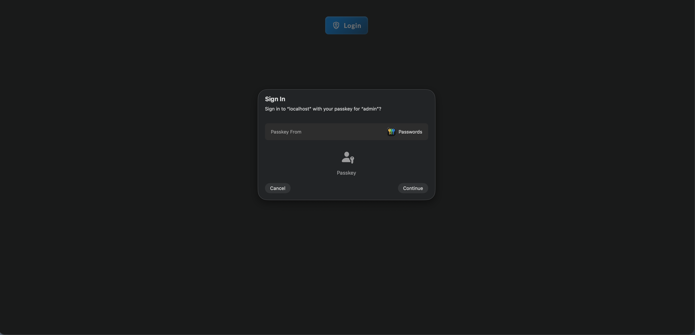
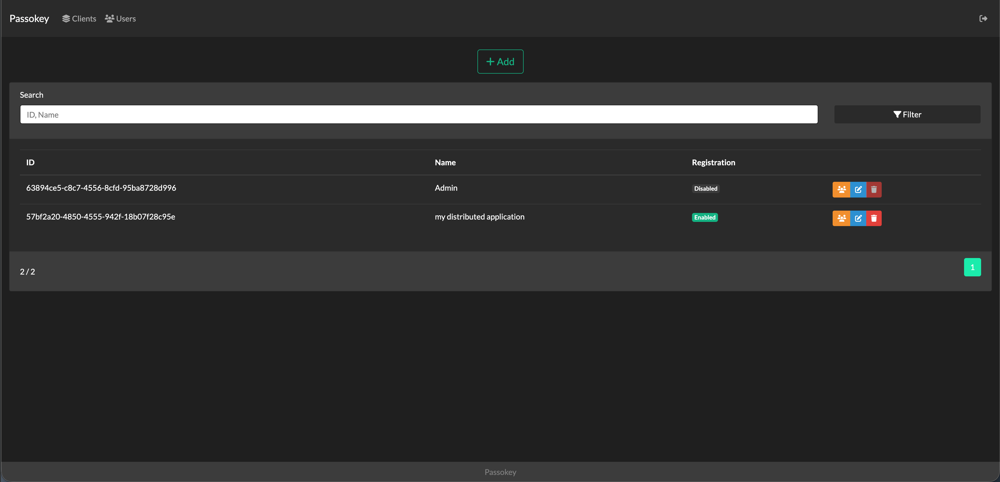
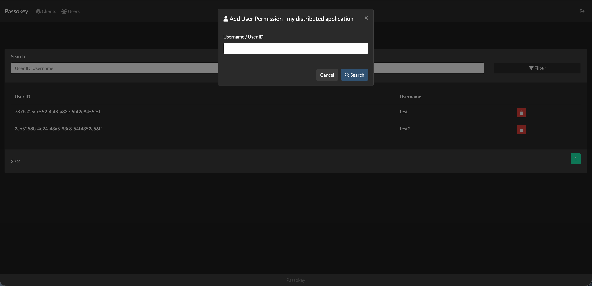

# Passokey

<a target="_blank" href="https://hub.docker.com/r/mahelbir/passokey"></a>
<a target="_blank" href="https://hub.docker.com/r/mahelbir/passokey"></a>

Passokey is a self-hosted Passkey (WebAuthn/FIDO2) authentication server with multi-client SSO support.

## ⭐ Features

- Passwordless authentication using Passkeys (WebAuthn/FIDO2)
- Multi-client architecture with SSO support
- Easy JWT-based integration with existing applications
- Standard OpenID Connect (OIDC) integration with existing applications
- User permission management per client
- Admin panel for managing clients, users, and permissions

## 🔐 Integration

The documentation is available at [docs folder](docs/INDEX.md).

## ⚙️ Configuration

```json
{
  "BaseUrl": "",
  // Site URL (e.g., "https://auth.example.com")
  "AppName": "",
  // Site name displayed to users
  "Session": {
    "IdleTimeoutMinutes": 0,
    // Session cleanup time after no activity
    "AuthorizedClientLifetimeMinutes": 0,
    // How long a user session remains valid after login
    "AdminSessionLifetimeMinutes": 0
    // How long an admin session remains valid after login
  },
  "Fido2": {
    "ServerDomain": "",
    // Your domain (e.g., "example.com")
    "ServerName": "",
    // Display name shown in passkey prompt
    "Origins": [],
    // Additional allowed origins (BaseUrl is included automatically)
    "TimestampDriftTolerance": 0
    // Allowed time difference (ms) between client and server clocks for authenticator timestamp validation
  },
  "Jwt": {
    "TokenLifetimeMinutes": 0
    // JWT token validity period; typically used by callback URL to create a real session
  }
}
```

## 🔧 How to Install

### 🐳 Docker (Recommended)

Download [appsettings.json](Application/appsettings.json) to data folder and configure it, then start
with [docker-compose.yaml](docker-compose.yaml):

```
curl -O https://raw.githubusercontent.com/mahelbir/passokey/main/docker-compose.yaml
curl --create-dirs -o data/appsettings.json https://raw.githubusercontent.com/mahelbir/passokey/main/Application/appsettings.json
nano data/appsettings.json
```

```
docker compose up -d
```

### 💪🏻 Non-Docker

Requirements:

- [.NET 10 SDK](https://dotnet.microsoft.com/en-us/download/dotnet/10.0)
- [Git](https://git-scm.com/downloads)

```bash
git clone https://github.com/mahelbir/passokey.git
cd passokey

# Copy and configure appsettings.json
cp Application/appsettings.json Application/appsettings.Production.json

# Publish and run the application
dotnet publish -c Release -o publish
publish/Application --environment Production
```

> Visit admin panel at http://localhost:4050/admin

### 🌐 Production Deployment

For production environments, you should expose Passokey behind a reverse proxy with HTTPS:

- **Nginx / Apache** - Traditional reverse proxy setup
- **Cloudflare Tunnel** - Zero-config secure tunnel without opening ports
- **Traefik** - Docker-native reverse proxy with automatic SSL
- **IIS** - Windows Server with ASP.NET Core Module
- etc.

> **Important:** WebAuthn/Passkeys require HTTPS in production (except for `localhost`)

## 🔄 How to Update

> Check the [Configuration](#-configuration) section for any new options and update your
`appsettings.json` accordingly.

### 🐳 Docker

It is recommended to check the latest [docker-compose.yaml](docker-compose.yaml) for any changes before updating.

Pull the latest image and recreate:

```
docker compose pull
docker compose up -d --force-recreate
```

### 💪🏻 Non-Docker

Pull the latest changes and publish:

```bash
git pull
dotnet publish -c Release -o publish
publish/Application --environment Production
```

## 🛠️ Technology Stack

| Technology        | Purpose                                                                                                                                                               |
|-------------------|-----------------------------------------------------------------------------------------------------------------------------------------------------------------------|
| .NET 10           | MVC framework                                                                                                                                                         |
| SQLite            | Database (file-based, no external dependencies)                                                                                                                       |
| FIDO2 (WebAuthn)  | Passkey authentication via [Fido2NetLib](https://github.com/passwordless-lib/fido2-net-lib) + [SimpleWebAuthn](https://www.npmjs.com/package/@simplewebauthn/browser) |
| JWT               | Token-based authentication for client integration                                                                                                                     |
| In-Memory Session | Session management (non-distributed)                                                                                                                                  |

> **Note:** This project is designed as a lightweight, simple authentication server suitable for small to medium-scale
> deployments. If you need enterprise-level scalability, you can fork this project and extend it with:
> - Distributed databases (PostgreSQL, MySQL, SQL Server)
> - Redis or distributed cache for session management
> - Horizontal scaling with load balancers
> - Advanced logging and monitoring solutions

## 🖼 Screenshots





## 🗣️ Discussion / Bug Report

- [GitHub Issues](https://github.com/mahelbir/passokey/issues)

## 📄 License

This project is licensed under the MIT License - see the [LICENSE](LICENSE) file for details.
